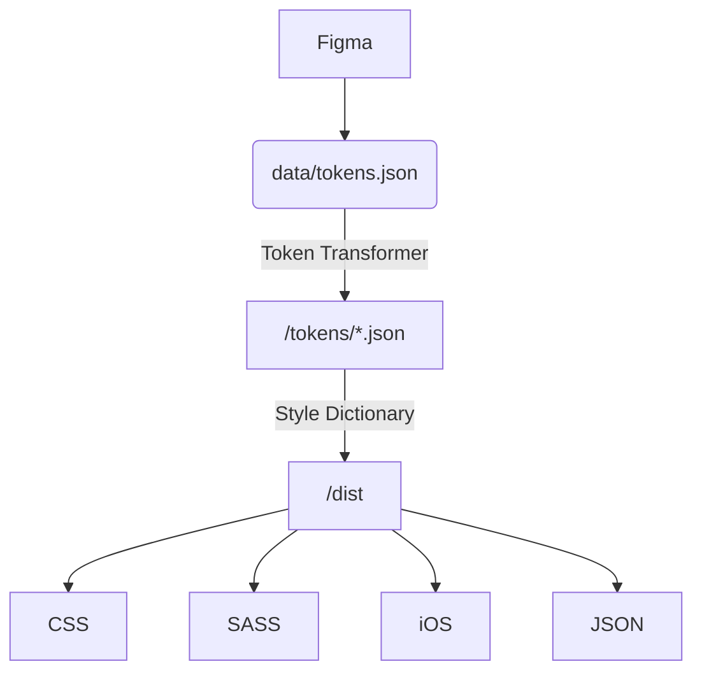

# Astro UXDS Design Tokens

> This repo is currently in beta and under heavy development. **Do not use in production**. Token names ma y change or be removed without any warning. Viewer discretion is advised.

This package includes all of [AstroUXDS's](https://www.astrouxds.com/) design tokens in various different formats for you to consume in your applications.

## Documentation

[Astro Design Tokens](https://next.astrouxds.org/design-tokens/getting-started/)

## Installation

`npm i @astrouxds/design-tokens@beta`

### Structure

Each export target has the following files:

* base.reference.*
  * All of the possible variables.
  * Useful in instances where there aren't any system options.
* base.system.*
  * A limited set of variables with semantic meaning
  * Useful for creating custom pieces of UI.
* base.component.*
  * Component-specific variables
  * Useful for recreating existing Astro components.

### CSS Custom Properties

`@import "node_modules/@astrouxds/design-tokens/dist/css/index.css";`

or

```css
@import "node_modules/@astrouxds/design-tokens/dist/css/base.reference.css";
@import "node_modules/@astrouxds/design-tokens/dist/css/base.system.css";
@import "node_modules/@astrouxds/design-tokens/dist/css/base.component.css";
```

### Light Theme Class

`@import "node_modules/@astrouxds/design-tokens/dist/css/theme.light.css";`

A `light-theme` class that includes Astro's light theme.

### Typography Utility Classes

`@import "node_modules/@astrouxds/design-tokens/dist/css/classes/typography.css";`

A few utility classes for applying Astro typography.

### SASS

```css
@import "node_modules/@astrouxds/design-tokens/dist/scss/base.reference.scss";
@import "node_modules/@astrouxds/design-tokens/dist/scss/base.system.scss";
@import "node_modules/@astrouxds/design-tokens/dist/scss/base.component.scss";
```

### SASS Maps

```css
@import "node_modules/@astrouxds/design-tokens/dist/scss-map-flat/base.reference.scss";
@import "node_modules/@astrouxds/design-tokens/dist/scss-map-flat/base.system.scss";
@import "node_modules/@astrouxds/design-tokens/dist/scss-map-flat/base.component.scss";
```


A few utility classes for applying Astro typography.
  
## Pipeline



## Contributing

### Building locally

`yarn make`