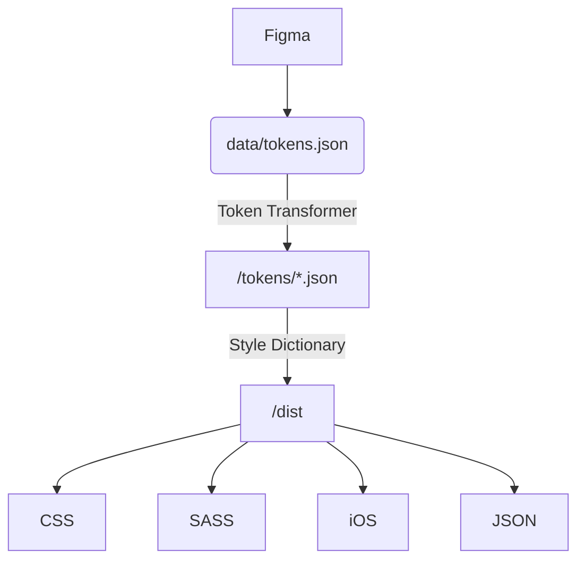

# Astro UXDS Design Tokens

> This repo is currently in beta and under heavy development. **Do not use in production**. Token names may change or be removed without any warning. Viewer discretion is advised.

This package includes all of [AstroUXDS's](https://www.astrouxds.com/) design tokens in various different formats for you to consume in your applications.

## Documentation

[Astro Design Tokens](https://astro-design-tokens.netlify.app)

## Installation

`npm i @astrouxds/design-tokens`

### CSS Custom Properties

`@import "node_modules/@astrouxds/design-tokens/dist/css/index.css";`

## Pipeline

