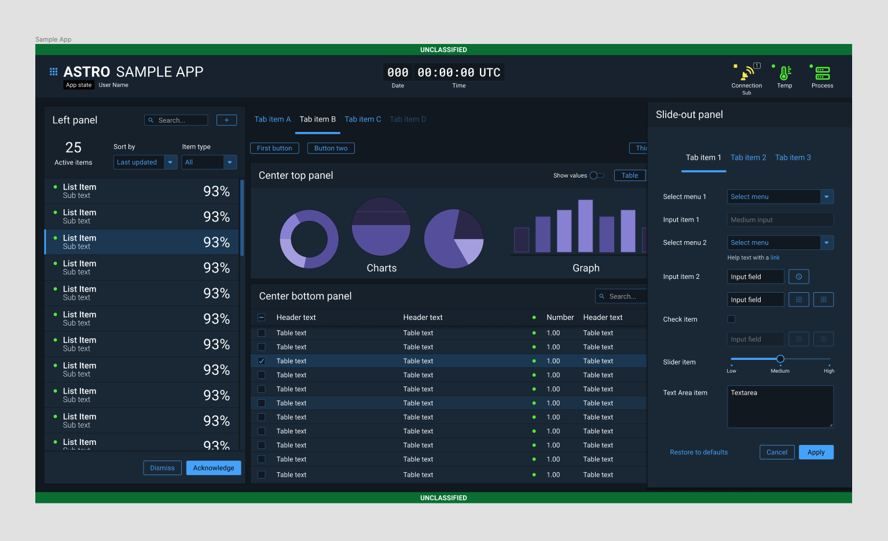
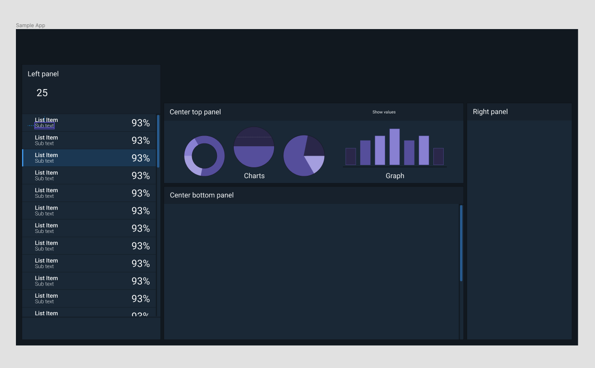
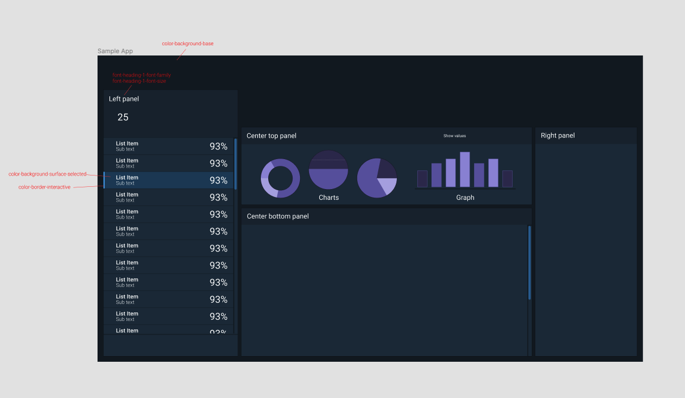

# Astro Design Tokens

## Introduction

### What are Design Tokens?

Design Tokens are design decisions. They are the core of the Design System and the single source of truth. They can describe everything from color to border radii to typography and follow a consistent naming convention. Most importantly, they are platform-agnostic. 

* The text color of a button is #fffff.
* The background color for all surface elements is #fff.
* Our base border radii is 3px. 
* The border color for a text input when it is invalid is #fff.

Translated into Design Tokens becomes:

* button-color-text
* color-background-surface
* radius-base
* input-color-border-invalid

### Why?

Design Tokens empower designer and developer workflows by providing answers to common questions like "what color should I use for XYZ?" Our components offer off the shelf solutions for common UI patterns, but they do not encompass the whole picture. While it is possible to build an application using nothing but Astro components, you will still need Design Tokens for things like spacing between the components themselves. In most cases, you will also need to create your own custom components. Design Tokens can help there as well.

## How Do I Use These?

### Reference Tokens

Reference Tokens are the complete palette and include all the possible values that are available to use. They do not convey any intent or meaning.

You **must** not create your own colors or values if you want to be Astro-compliant. Our color values are very carefully chosen in order to meet WCAG accessibility compliance among others. If you feel there is a particular color or token value missing from our palette, please reach out with a proposal. 

### System Tokens

Reference Tokens help enforce consistency; however, the sheer number of them can be overwhelming. To aid you in determining what tokens to use, Astro offers System Tokens to better convey intent and usage. System Tokens are the preferred way of interacting with the design system. All System Tokens reference our reference tokens. They better describe overall patterns and concepts like `interactive` or `surface`.

### Component Tokens

Component Tokens are blueprints used to describe all properties of individual components. They should only be used in scenarios where you are rebuilding existing Astro components. For example:

1. Unable to use to use our Figma and Web Component libraries. For example, developing a native Windows application, designing in Adobe XD, etc.
2. Theming an existing component library or design system. For example, Bootstrap or Material.

Component tokens are scoped to individual components. They should not be used outside of the component. Instead, you should use the token that is being referenced directly. For example, don't use `button-color-background-hover` in a list component. In this scenario you would see that `button-color-background-hover` references `color.background.interactive.default` and use the system token instead. 

## Naming Convention

	<ol class="m-0 p-0 grid grid-flow-col auto-cols-max items-center text-white">
		<li class="bg-green-600  p-4">Group</li> 
		<li class="bg-green-500 p-4">Component</li> 
		<li class="bg-green-300 p-4 text-black">Element</li> 
		<li class="bg-blue-500 p-4">Category</li> 
                <li class="bg-blue-300 p-4">Property</li> 
		<li class="bg-red-500 p-4">Variant</li>
		<li class="bg-red-400 p-4">State</li> 
		<li class="bg-red-200 p-4 text-black">Scale</li>
      </ol>

## Design Tokens In Use
Our component library can provides out of the box components for common UI elements. However, a real life application is more than just a collection of components because not everything is a component. In addition, you will find yourself needing to design your own custom components. 

Here is an example of a sample application.

When we remove all of our Astro components, this is what we're left with and the design system reveals itself.

